# DHV - SVM Learning Hub


## 🎯 Project Title and Description

**DHV (SVM Learning Hub)** is an interactive educational web application designed to help users understand Support Vector Machines (SVM) through hands-on visualizations and intuitive explanations. The platform provides a comprehensive learning experience covering SVM concepts, different kernel types, parameter tuning, and the relationship between hard and soft margins.

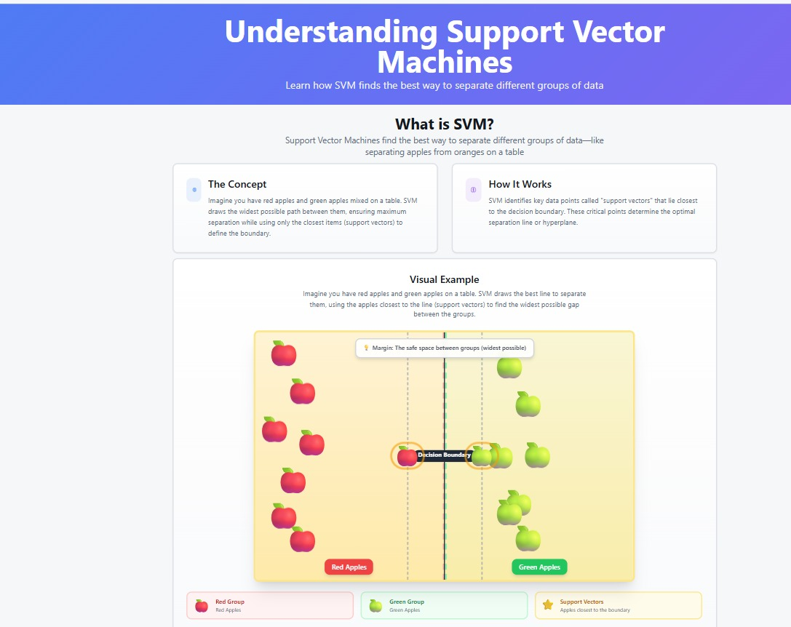
*Understanding Support Vector Machines - Learn how SVM finds the best way to separate different groups of data*


### Key Concepts Covered

- **Support Vectors**: The critical data points that lie closest to the decision boundary
- **Decision Boundary**: The optimal line or hyperplane that separates different classes
- **Margin**: The safe space between classes (widest possible separation)
- **Kernels**: Functions that transform data to enable non-linear classification
- **Parameters**: Configurable settings that control model behavior (hard vs soft margins, regularization, etc.)

---

## ✨ Features

### 📚 Educational Content
- **Interactive Introduction**: Learn SVM concepts through visual analogies (e.g., separating red and green apples)
- **Parameter Explanations**: Understand how different parameters affect model behavior
- **Margin Visualization**: See the difference between hard and soft margins with interactive demonstrations

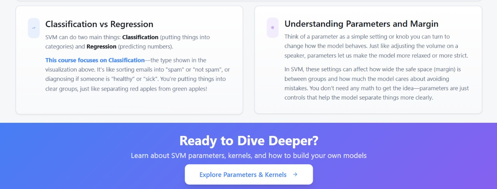
*Understanding SVM Applications - Classification and Parameter Controls*

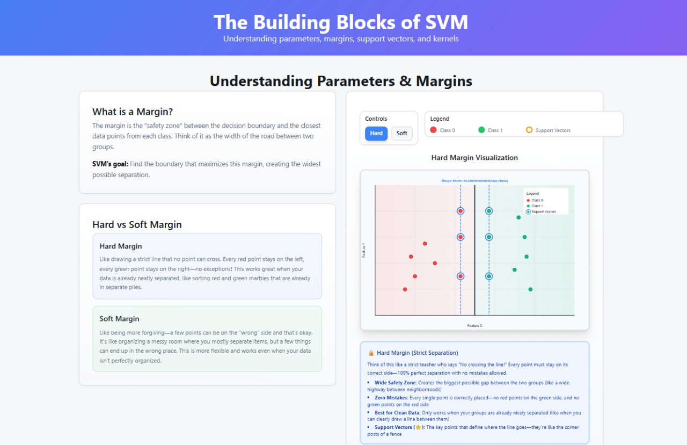
*The Building Blocks of SVM - Understanding parameters, margins, support vectors, and kernels*

#### How SVM Works - Step by Step

The application provides an interactive step-by-step walkthrough of how Support Vector Machines work:

**Step 1: Plot all data points in space**

*Visualize all data points (approved in green, rejected in red) in a 2D space with features like income and credit score*

**Step 2: Test multiple potential separation lines**
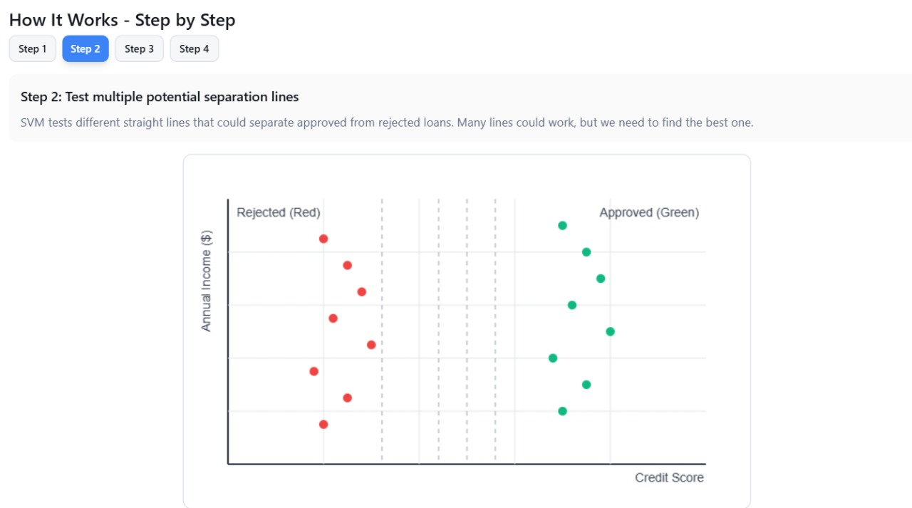
*SVM tests different straight lines that could separate approved from rejected loans to find the best one*

**Step 3: Maximize margin - select the line with widest margin**
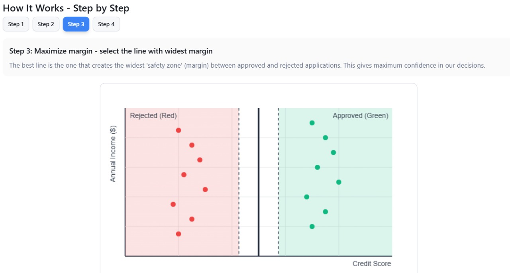
*The best line creates the widest 'safety zone' (margin) between classes, giving maximum confidence in decisions*

**Step 4: Identify support vectors**
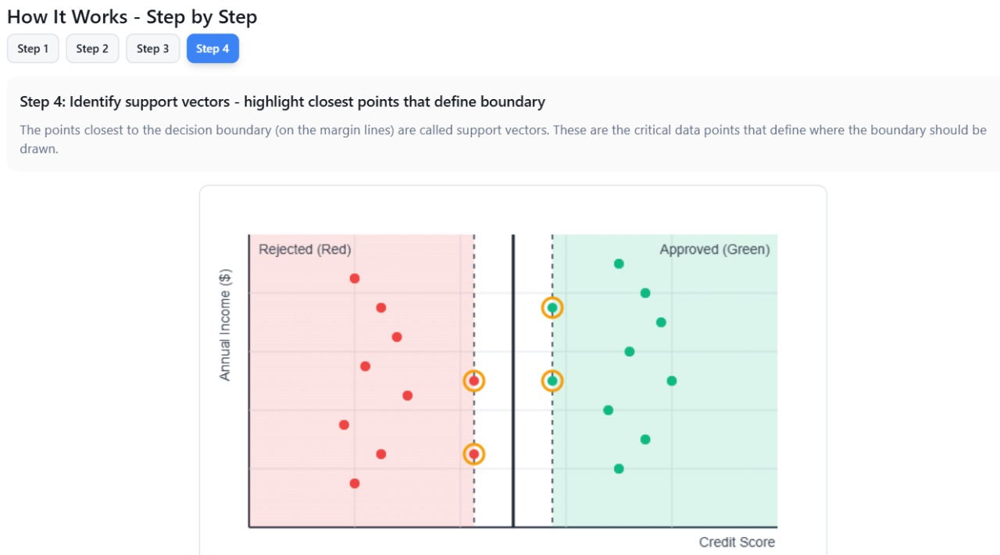
*The points closest to the decision boundary (on the margin lines) are support vectors - critical data points that define where the boundary should be drawn*

### 🔬 Kernel Types
The application covers four major SVM kernel types:

1. **Linear Kernel**: Simple linear separation for linearly separable data
2. **Polynomial Kernel**: Non-linear separation using polynomial transformations
3. **RBF (Radial Basis Function) Kernel**: Highly flexible kernel for complex non-linear patterns
4. **Sigmoid Kernel**: Neural network-inspired kernel function

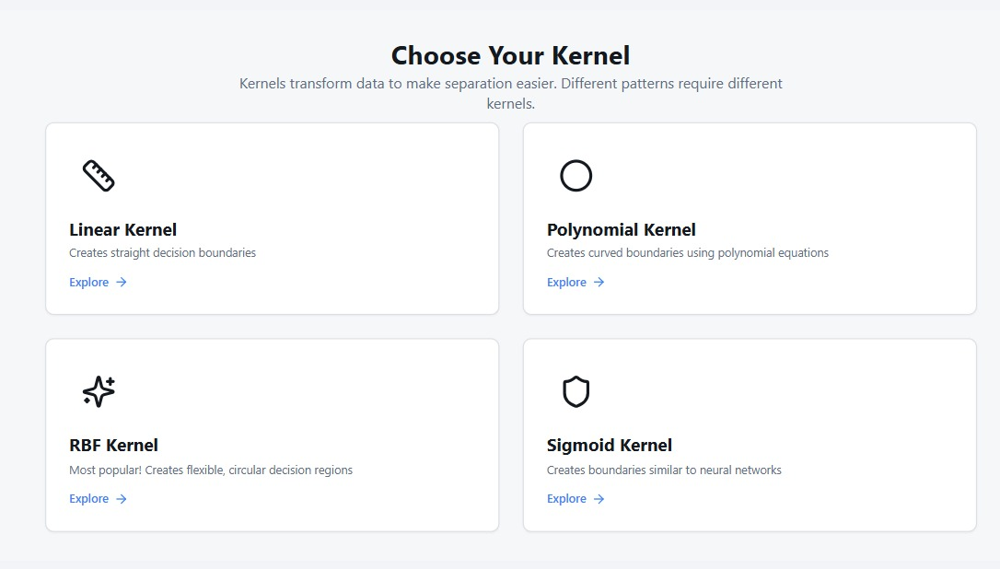
*Choose Your Kernel - Different kernels transform data to make separation easier for various patterns*

### 🎨 Interactive Visualizations
- **Canvas-based Graphics**: Real-time rendering of data points, decision boundaries, and margins
- **Animation Support**: Smooth transitions and animations to illustrate concepts
- **Interactive Parameter Tuning**: Adjust parameters and see immediate visual feedback
- **Support Vector Highlighting**: Visual identification of support vectors

#### Hard Margin Visualization
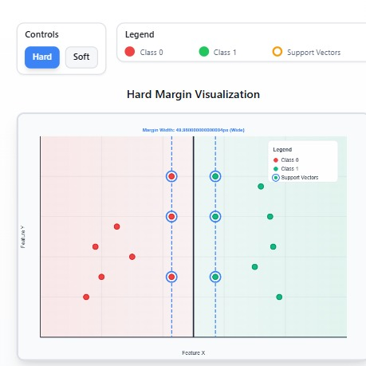
*Hard Margin SVM - Strict separation with zero tolerance for mistakes, creating the widest possible margin*

#### Soft Margin Visualization
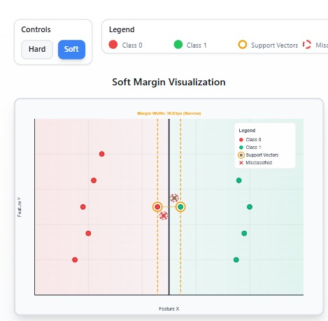
*Soft Margin SVM - Flexible separation that allows some misclassified points for better generalization*

#### Decision Boundary Visualizations

Explore how different polynomial kernel degrees create different decision boundaries:

**Degree 1 - Linear Boundary**
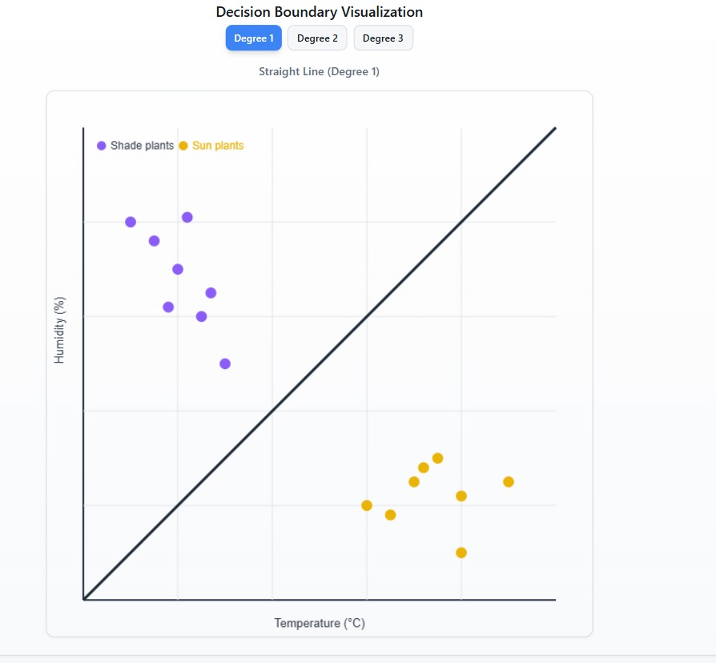
*Straight Line (Degree 1) - Linear decision boundary separating 'Shade plants' and 'Sun plants' based on temperature and humidity*

**Degree 2 - Quadratic Curve**
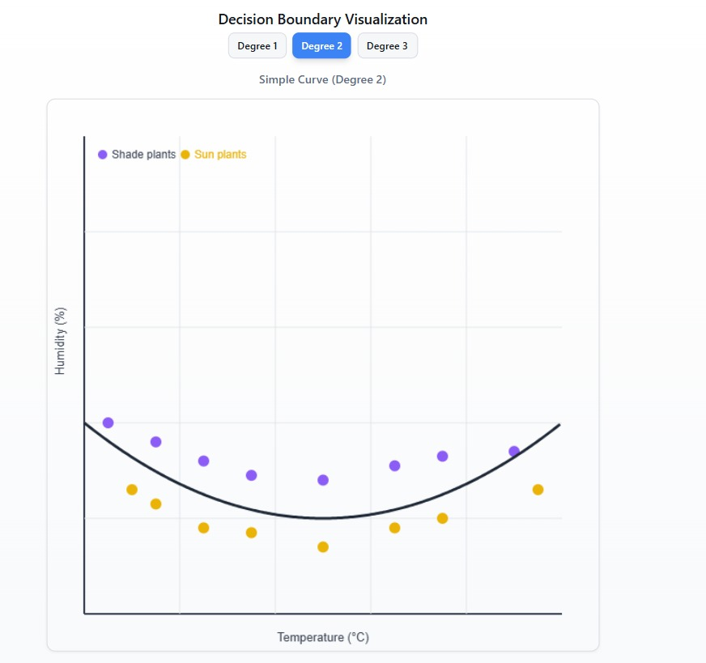
*Simple Curve (Degree 2) - U-shaped quadratic decision boundary for non-linear classification*

**Degree 3 - Cubic Wave**
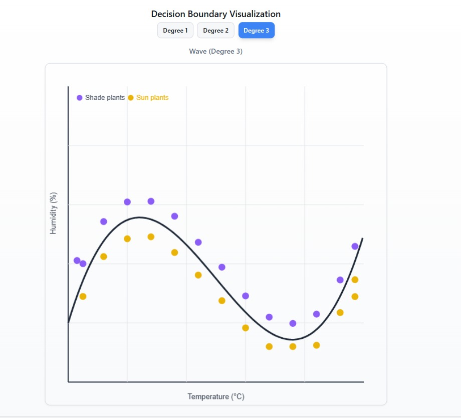
*Wave (Degree 3) - Wavy decision boundary demonstrating higher-order polynomial kernel transformations*

### 🎯 User Experience
- **Responsive Design**: Works seamlessly on desktop, tablet, and mobile devices
- **Modern UI**: Built with shadcn-ui components and Tailwind CSS
- **Smooth Navigation**: Intuitive routing between different learning sections
- **Visual Feedback**: Toast notifications and tooltips for better user guidance

---

## 🛠 Technology Stack

### Core Technologies
- **React 18.3.1**: Modern React with hooks and functional components
- **TypeScript 5.8.3**: Type-safe JavaScript for better code quality
- **Vite 5.4.19**: Fast build tool and development server
- **React Router DOM 6.30.1**: Client-side routing for single-page application

### UI Libraries & Components
- **shadcn-ui**: High-quality, accessible React components
- **Radix UI**: Unstyled, accessible component primitives
  - Dialog, Dropdown, Toast, Tooltip, Accordion, and more
- **Tailwind CSS 3.4.17**: Utility-first CSS framework
- **Lucide React**: Beautiful icon library
- **next-themes**: Theme management (dark/light mode support)

### State Management & Data
- **TanStack Query (React Query) 5.83.0**: Server state management and data fetching
- **React Hook Form 7.61.1**: Performant form management
- **Zod 3.25.76**: TypeScript-first schema validation

### Visualization & Charts
- **Recharts 2.15.4**: Composable charting library for React
- **HTML5 Canvas**: Custom canvas-based visualizations for SVM concepts

### Development Tools
- **ESLint**: Code linting and quality assurance
- **TypeScript ESLint**: TypeScript-specific linting rules
- **PostCSS & Autoprefixer**: CSS processing and browser compatibility
- **SWC**: Fast React compiler for development

---

## 📦 Installation & Setup

### Prerequisites

Before you begin, ensure you have the following installed:
- **Node.js** (v18 or higher recommended)
- **npm** (v9 or higher) or **bun** (optional, for faster package management)

### Installation Steps

1. **Clone the repository**
   ```bash
   git clone https://github.com/HARI-IIITD/dhv.git
   cd dhv
   ```

2. **Install dependencies**
   ```bash
   npm install
   ```
   Or if you're using bun:
   ```bash
   bun install
   ```

3. **Start the development server**
   ```bash
   npm run dev
   ```
   The application will be available at `http://localhost:8080`

4. **Build for production**
   ```bash
   npm run build
   ```

5. **Preview production build**
   ```bash
   npm run preview
   ```

### Environment Setup

No environment variables are required for basic functionality. The application runs entirely client-side.

---

## 📖 Usage Instructions

### Getting Started

1. **Launch the Application**: Start the development server using `npm run dev`
2. **Navigate to Home**: Open your browser and go to `http://localhost:8080`
3. **Start Learning**: Begin with the Introduction page to understand SVM basics


### Interactive Features

- **Parameter Sliders**: Adjust kernel parameters and see real-time updates
- **Canvas Visualizations**: Interactive charts showing data points and decision boundaries
- **Animation Controls**: Watch animations explaining SVM concepts
- **Tooltips**: Hover over elements for additional information
- **Responsive Design**: Use on any device size

---

## 📁 Project Structure

```
dhv/
├── public/                 # Static assets
│   ├── placeholder.svg    # Placeholder images
│   └── robots.txt         # SEO robots file
│
├── pages/                  # HTML pages (if any)
│   └── sigmoid-parameter.html
│
├── src/                    # Source code
│   ├── components/         # React components
│   │   ├── ui/            # shadcn-ui components
│   │   │   ├── button.tsx
│   │   │   ├── card.tsx
│   │   │   ├── dialog.tsx
│   │   │   ├── toast.tsx
│   │   │   └── ...        # Other UI components
│   │   └── ScrollToTop.tsx # Scroll to top component
│   │
│   ├── hooks/              # Custom React hooks
│   │   ├── use-mobile.tsx  # Mobile detection hook
│   │   └── use-toast.ts    # Toast notification hook
│   │
│   ├── lib/                # Utility libraries
│   │   └── utils.ts        # Helper functions
│   │
│   ├── pages/              # Page components
│   │   ├── Introduction.tsx           # Home/Introduction page
│   │   ├── Parameters.tsx             # Parameters explanation page
│   │   ├── LinearKernel.tsx           # Linear kernel page
│   │   ├── LinearParameters.tsx       # Linear parameters page
│   │   ├── PolynomialKernel.tsx       # Polynomial kernel page
│   │   ├── RBFKernel.tsx              # RBF kernel page
│   │   ├── RBFParameters.tsx          # RBF parameters page
│   │   ├── SigmoidKernel.tsx          # Sigmoid kernel page
│   │   ├── SigmoidKernelParameters.tsx # Sigmoid parameters page
│   │   ├── NotFound.tsx               # 404 page
│   │   └── temp.tsx                   # Temporary/test page
│   │
│   ├── routes/             # Route configurations
│   │   ├── sigmoidRoutes.tsx          # Sigmoid route definitions
│   │   └── sigmoidParameterRoute.ts   # Sigmoid parameter route
│   │
│   ├── App.tsx             # Main application component
│   ├── main.tsx            # Application entry point
│   ├── index.css           # Global styles
│   └── vite-env.d.ts       # Vite type definitions
│
├── .gitignore              # Git ignore file
├── components.json         # shadcn-ui configuration
├── eslint.config.js        # ESLint configuration
├── index.html              # HTML entry point
├── package.json            # Project dependencies and scripts
├── postcss.config.js       # PostCSS configuration
├── tailwind.config.ts      # Tailwind CSS configuration
├── tsconfig.json           # TypeScript configuration
├── tsconfig.app.json       # TypeScript app configuration
├── tsconfig.node.json      # TypeScript node configuration
├── vite.config.ts          # Vite configuration
└── README.md               # Project documentation
```


## 🔄 Project Flow

### Application Flow

```
┌─────────────────────────────────────────────────────────────┐
│                    Application Startup                       │
│  (main.tsx → App.tsx → React Router Setup)                  │
└──────────────────────┬──────────────────────────────────────┘
                       │
                       ▼
┌─────────────────────────────────────────────────────────────┐
│                    Route Configuration                       │
│  - Introduction (/)                                          │
│  - Parameters (/parameters)                                  │
│  - Kernel Pages (Linear, Polynomial, RBF, Sigmoid)          │
│  - Parameter Pages (Linear, RBF, Sigmoid)                   │
│  - 404 Page (*)                                              │
└──────────────────────┬──────────────────────────────────────┘
                       │
                       ▼
┌─────────────────────────────────────────────────────────────┐
│                    User Navigation Flow                      │
│                                                              │
│  1. Introduction Page                                        │
│     ├─ Learn SVM basics                                      │
│     ├─ View visualizations                                   │
│     └─ Navigate to Parameters                                │
│                                                              │
│  2. Parameters Page                                          │
│     ├─ Understand hard/soft margins                          │
│     ├─ Interact with parameter controls                      │
│     └─ Navigate to Kernel pages                              │
│                                                              │
│  3. Kernel Pages (Linear, Polynomial, RBF, Sigmoid)         │
│     ├─ Learn about kernel types                              │
│     ├─ View kernel-specific visualizations                   │
│     └─ Navigate to Parameter pages                           │
│                                                              │
│  4. Parameter Pages                                          │
│     ├─ Adjust kernel parameters                              │
│     ├─ See real-time visualizations                          │
│     └─ Understand parameter effects                          │
│                                                              │
└─────────────────────────────────────────────────────────────┘
```


### Visualization Flow

1. **Data Generation**: Points are generated based on kernel type and parameters
2. **Canvas Rendering**: HTML5 Canvas renders data points, boundaries, and margins
3. **Animation**: Smooth animations illustrate concepts (if enabled)
4. **User Interaction**: Parameter changes trigger re-rendering
5. **Real-time Updates**: Visualizations update immediately on parameter changes

---

## 💻 Development

### Available Scripts

- **`npm run dev`**: Start development server on port 8080
- **`npm run build`**: Build production bundle
- **`npm run build:dev`**: Build development bundle
- **`npm run preview`**: Preview production build locally
- **`npm run lint`**: Run ESLint to check code quality

### Development Guidelines

1. **TypeScript**: All components should be written in TypeScript
2. **Component Structure**: Use functional components with hooks
3. **Styling**: Use Tailwind CSS utility classes
4. **UI Components**: Use shadcn-ui components from `src/components/ui/`
5. **Routing**: Add new routes in `src/App.tsx`
6. **State Management**: Use React hooks (useState, useEffect) for local state
7. **API Calls**: Use TanStack Query for server state (if needed)


## 🤝 Contributing

Contributions are welcome! Please follow these steps:

1. **Fork the repository**
2. **Create a feature branch**:
   ```bash
   git checkout -b feature/your-feature-name
   ```
3. **Make your changes**
4. **Commit your changes**:
   ```bash
   git commit -m "Add your meaningful commit message"
   ```
5. **Push to the branch**:
   ```bash
   git push origin feature/your-feature-name
   ```
6. **Create a Pull Request**

### Contribution Guidelines

- Follow the existing code style
- Write meaningful commit messages
- Add comments for complex logic
- Test your changes thoroughly
- Update documentation if needed


## 🔗 Links

- **Live Demo**: [dhv-vert.vercel.app](https://dhv-vert.vercel.app)
- **GitHub Repository**: [HARI-IIITD/dhv](https://github.com/HARI-IIITD/dhv)

